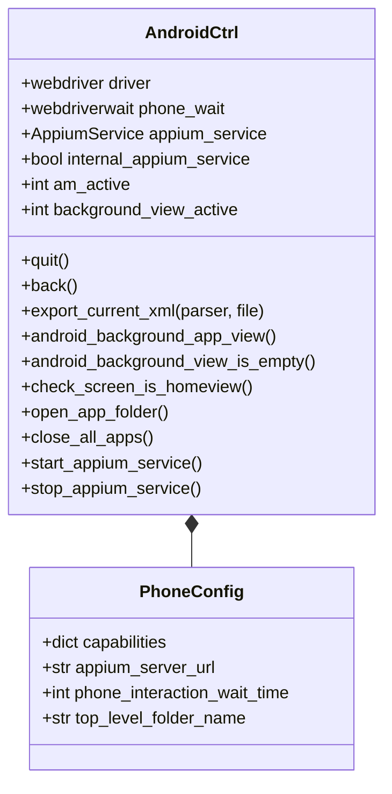

# miAndroid
This is to be a top level/parent package/class for the interfacing with a Android Phone Emulation. The class mainly covers basis setup of the 'Appium' Webdriver, as well as a few functions to check the emulation is in a fit state for the intended app to be opened.

# Class structure
The XML below gives a view of the class, as can be seen the class 'AndroidCtrl' is dependent upon the 'PhoneConfig'. The 'PhoneConfig' only contains variables which are to be used to change 'basic' features within 'AndroidCtrl' (e.g. wait durations, folder names, etc.).

> Will aim to have this as "up-to-date" as possible. However, see the actual python code for the actual names/functions/etc.

